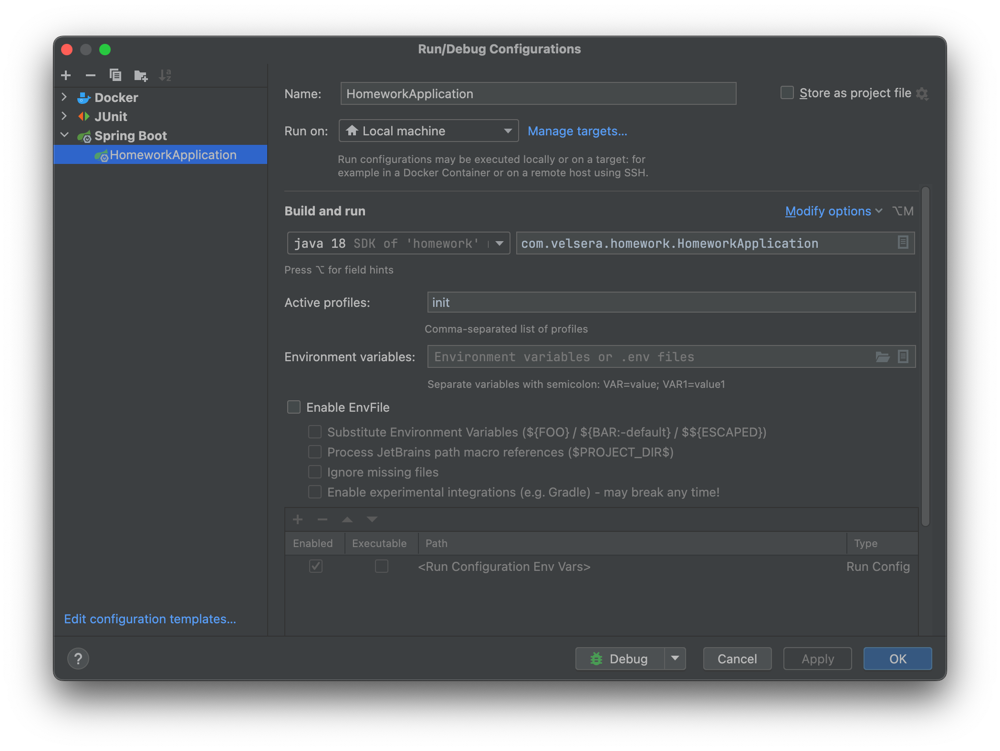
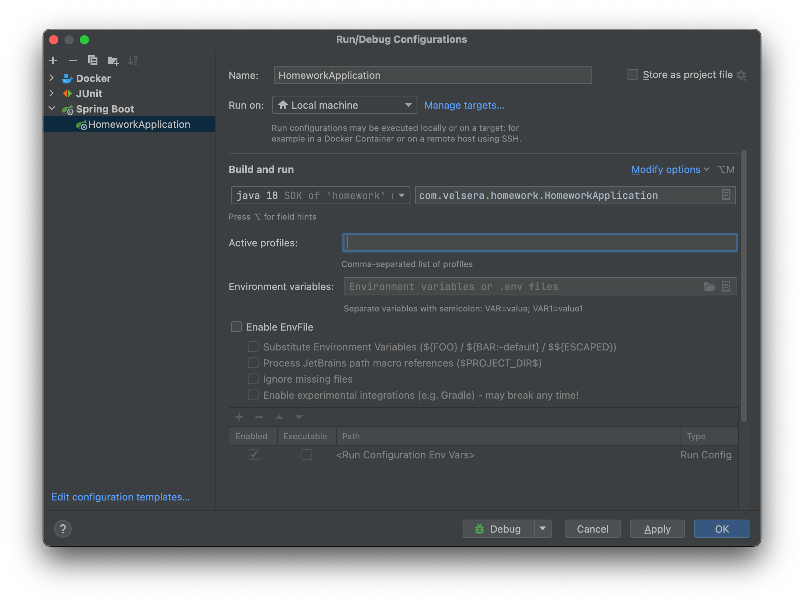

# homework/velsera

A set of interacting services that mimic some endpoints of the Twitter API.

---

## Table of Contents

1. [Introduction](#introduction)
2. [Getting Started](#getting-started)
    - [Required Software](#required-software)
    - [Build, Up and Running Postgres Database](#build-up-and-running-postgres-database)
    - [Cloning the Project](#cloning-the-project)
    - [Build & Test in Isolation](#build-test-in-isolation)
3. [Run the Service](#run-the-service)
4. [Dockerized Application](#dockerized-application)
    - [Building Docker Image](#building-docker-image)
    - [Verify the Application is up and Running](#verify-the-application-is-up-and-running)
5. [Application APIs](#application-apis)
6. [License](#license)

## Introduction

This project is built using Jakarta EE with Jakarta imports, Spring Data JPA, Spring MVC, Lombok, and Java SDK version

18. It features a simple Twitter-like application that allows creation, deletion, and retrieval of tweets.

## Getting Started

### Required Software

The following software is required:

1. **Maven**: Apache Maven is a software project management and comprehension tool. Download it
   from [here](https://maven.apache.org/download.cgi).
2. **Git**: Download and install from [here](https://git-scm.com/downloads).
3. **Java, JDK 18**: Download and install from [here](https://www.oracle.com/java/technologies/downloads/).
4. **Docker**: Download and install from [here](https://www.docker.com/).
5. **curl**: A command-line tool for testing HTTP-based APIs. Download and install
   from [here](https://curl.haxx.se/download.html).
6. **(Optional and convenient)**: Install SDKMAN from [here](https://sdkman.io/). SDKMAN is a tool for managing parallel
   versions of multiple Software Development Kits (SDKs) on most Unix-based systems.

Follow the installation guides on each software's website and verify the installations from the command line.

### Build, Up and Running Postgres Database

To run this application from an IDE, ensure you have a local Postgres database service up and running. Install Docker on
your machine and run the following script to download and configure the Postgres database:

```bash
cd ~/homework/src/main/docker/local/postgres/ && sh setup_postgres.sh
```

### Cloning the Project

Clone the project by opening **git bash** or command-line and running:

```bash
git clone https://gitlab.com/velsera/homework.git
```

### Build & Test in Isolation

Ensure Java is set to JDK 18 and Docker client (docker-desktop) is running. To build and run all test cases, execute:

```bash
mvn clean install -U
```

Successful build and test output should look like this:

```bash
[INFO] ------------------------------------------------------------------------
[INFO] BUILD SUCCESS
[INFO] ------------------------------------------------------------------------
[INFO] Total time:  14.990 s
[INFO] Finished at: 2024-05-25T23:12:28+02:00
[INFO] ------------------------------------------------------------------------
```

## Run the Service

Run the application from your IDE. Initially, activate the \`init\` profile so that Liquibase scripts can be executed:



Once completed, switch back to the default profile:



## Dockerized Application

Ensure Docker Desktop is installed, up, and running.

### Building Docker Image

To build the Docker image and run the application in a Docker container, execute this script from the root folder:

```bash
sh ./dockerize_application.sh
```

### Verify the Application is up and Running

Successful start message in the terminal should look like:

```bash
app-1        | 2024-05-26T16:27:58.200Z DEBUG 1 --- [homework] [           main] s.w.s.m.m.a.RequestMappingHandlerMapping : 5 mappings in 'requestMappingHandlerMapping'
app-1        | 2024-05-26T16:27:59.044Z DEBUG 1 --- [homework] [           main] o.s.w.s.handler.SimpleUrlHandlerMapping  : Patterns [/webjars/**, /**] in 'resourceHandlerMapping'
app-1        | 2024-05-26T16:27:59.412Z DEBUG 1 --- [homework] [           main] s.w.s.m.m.a.RequestMappingHandlerAdapter : ControllerAdvice beans: 0 @ModelAttribute, 0 @InitBinder, 1 RequestBodyAdvice, 1 ResponseBodyAdvice
app-1        | 2024-05-26T16:27:59.634Z DEBUG 1 --- [homework] [           main] .m.m.a.ExceptionHandlerExceptionResolver : ControllerAdvice beans: 1 @ExceptionHandler, 1 ResponseBodyAdvice
app-1        | 2024-05-26T16:28:03.012Z  INFO 1 --- [homework] [           main] o.s.b.a.e.web.EndpointLinksResolver      : Exposing 14 endpoint(s) beneath base path '/actuator'
app-1        | 2024-05-26T16:28:03.567Z  INFO 1 --- [homework] [           main] o.s.b.w.embedded.tomcat.TomcatWebServer  : Tomcat started on port 8080 (http) with context path '/v1'
app-1        | 2024-05-26T16:28:03.670Z  INFO 1 --- [homework] [           main] c.velsera.homework.HomeworkApplication   : Started HomeworkApplication in 37.863 seconds (process running for 45.212)
app-1        | 2024-05-26T16:28:03.715Z  INFO 1 --- [homework] [           main] c.velsera.homework.HomeworkApplication   : Application is Up & Running!
```

## Application APIs

Check the application APIs by opening the \`src/main/resources/swagger/open-api-spec.yml\` file and copying its content
to the [Swagger Online Editor](https://editor-next.swagger.io/).

## License

MIT License

```
MIT License

Copyright (c) 2024 Andrija Djerasevic

Permission is hereby granted, free of charge, to any person obtaining a copy
of this software and associated documentation files (the "Software"), to deal
in the Software without restriction, including without limitation the rights
to use, copy, modify, merge, publish, distribute, sublicense, and/or sell
copies of the Software, and to permit persons to whom the Software is
furnished to do so, subject to the following conditions:

The above copyright notice and this permission notice shall be included in all
copies or substantial portions of the Software.

THE SOFTWARE IS PROVIDED "AS IS", WITHOUT WARRANTY OF ANY KIND, EXPRESS OR
IMPLIED, INCLUDING BUT NOT LIMITED TO THE WARRANTIES OF MERCHANTABILITY,
FITNESS FOR A PARTICULAR PURPOSE AND NONINFRINGEMENT. IN NO EVENT SHALL THE
AUTHORS OR COPYRIGHT HOLDERS BE LIABLE FOR ANY CLAIM, DAMAGES OR OTHER
LIABILITY, WHETHER IN AN ACTION OF CONTRACT, TORT OR OTHERWISE, ARISING FROM,
OUT OF OR IN CONNECTION WITH THE SOFTWARE OR THE USE OR OTHER DEALINGS IN THE
SOFTWARE.
```

---

Happy Coding 😊

Copyright (c) 2024 Andrija Djerasevic